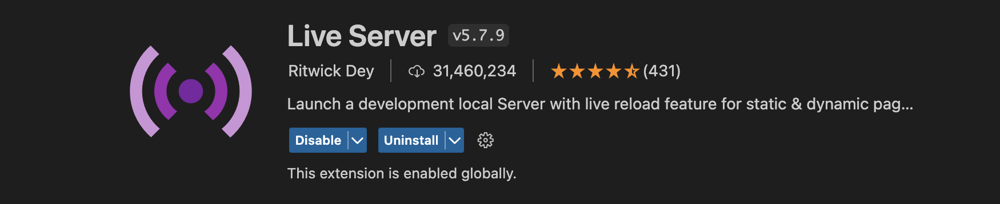

## Snake

This is a basic Snake game built for the web browser using JavaScript, HTML and basic CSS.

### Instalation

```js
$ git clone https://github.com/ghpaterson/snake-game.git
$ cd snake-game
```

## Run the App

Open the snake-game directory in your VSCode and make sure you have the Live Server extension installed (see below).

Click 'Go Live' on the bottom-right of VSCode and the application will be launched in your browser

## Live Server



## Game Rules

- Use the arrow keys on your keyboard to control your GREEN snake

- Each time your snake eats the YELLOW food it will grow

- The game will end if the snake hits the side of the GREY game area or the snake comes into contact with itself.
